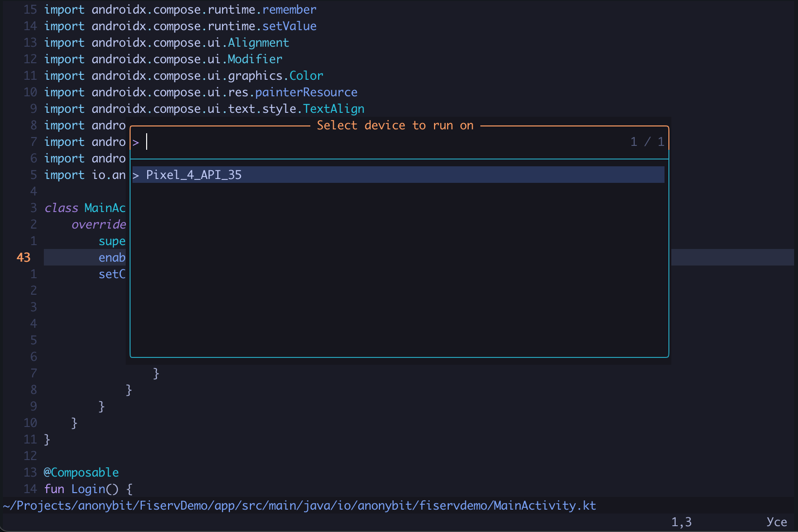
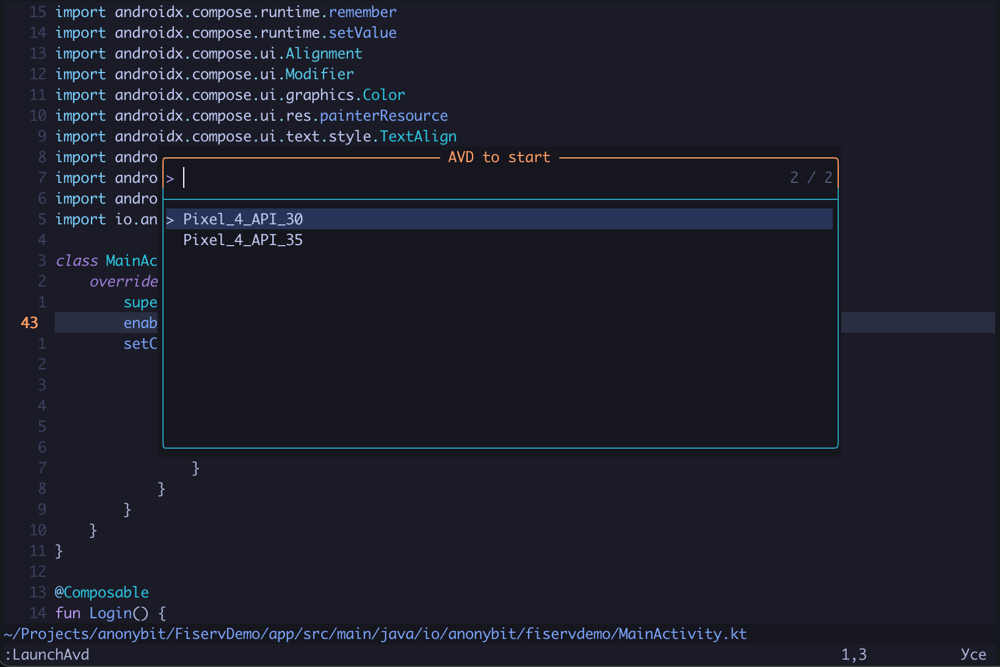

### Android Neovim plugin

This plugin was created as an effort for me to able to work on multiple different language projects from a single terminal. There are options for working with xcode projects, flutter, web frontend and backend, and this project is here to expand that plugin ecosystem.

At the moment this plugin is under heavy development and only has features that I personally needed at the moment, but feel free to expand on it, experiment and break it. It is my first attempt at something like this, but I hope it can be useful.

#### Installation

**With `lazy.nvim`**

```lua
{
    "ariedov/android-nvim",
    config = function()
      -- OPTIONAL: specify android sdk directory
      -- vim.g.android_sdk = "~/Library/Android/sdk"
      require('android-nvim').setup()
    end
}
```





#### Features:

The plugin will find for the nearest parent `gradlew` to ensure it can perform operations with your projects.

For the plugin to know the location of the android sdk you have to set one of the following:

- Set the `ANDROID_HOME` environment variable
- Set the android sdk location manually inside `vim.g.android_sdk = "<path to the android sdk folder>"`

The plugin will then find `adb` and related tools for performing operations with the project and devices.

#### Commands:

The plugin does provide some user commands for ease of use:

| Command Name        | Description                                       |
| ------------------- | ------------------------------------------------- |
| AndroidBuildRelease | Builds the release version of the application     |
| AndroidRun          | Builds and runs debug version of your application | 
| AndroidClean        | Cleans the build folder of the application        |
| LaunchAvd           | Launches the selected virtual device              |
